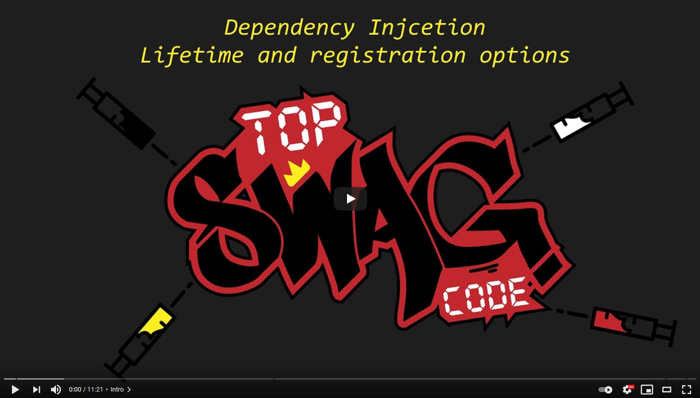

# Dotnet.Fundamentals

This is a small repository sharing some example projects for Dotnet fundamentals. Some might be posted as a youtube clip as well. All guides will contain links to documentation, if you want to dig deeper.

# Dependency Injaction

Microsoft docs Dependency Injection: https://docs.microsoft.com/en-us/aspnet/core/fundamentals/dependency-injection?view=aspnetcore-5.0

Microsoft docs Options Configuration:
https://docs.microsoft.com/en-us/aspnet/core/fundamentals/configuration/?view=aspnetcore-5.0

# Roadmap

* Add more fundamental guides here :)
* Have fun